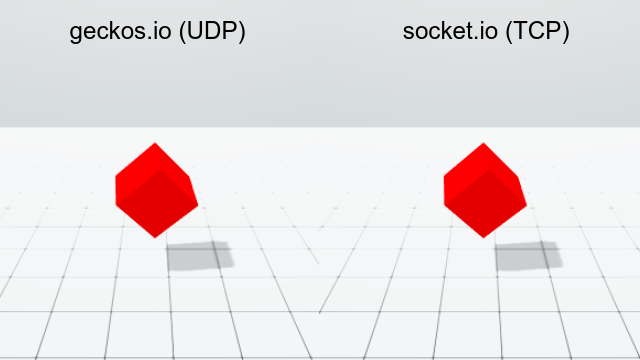
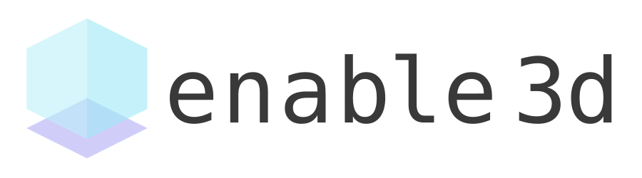

<div align="center">

<a href="http://geckos.io">

</a>

# geckos.io

### Geckos&#46;io offers real-time client/server communication over UDP using WebRTC and Node.js

#### _Geckos&#46;io fits perfectly with your next HTML5 real-time multiplayer games or chat app._

[](https://www.npmjs.com/package/@geckos.io/server)
[](https://github.com/geckosio/geckos.io/actions?query=workflow%3ACI)
[](https://david-dm.org/geckosio/geckos.io?path=packages%2Fserver)
[](https://www.npmjs.com/package/@geckos.io/server)

[](https://codecov.io/gh/geckosio/geckos.io)

</div>

---

## What is it made for?

It's designed specifically for your HTML5 real-time multiplayer games by lowering the average latency and preventing huge latency spikes. It allows you to communicate with your node.js server via UDP, which is much faster than TCP (used by WebSocket). Take a look at the comparison video between UDP and TCP.
https://youtu.be/ZEEBsq3eQmg

<a href="https://youtu.be/ZEEBsq3eQmg"></a>

## Getting Started

First things first, install it via npm:

```console
npm install @geckos.io/client @geckos.io/server
```

---

## New in version >= 1.7.1 (soon)

You can now pass a more complex url to the client when you set port to `null`. This is useful if, for example, you use the geckos.io server behind a proxy.

```js
// client.js

// default is
const channel = geckos({
  url: `${location.protocol}//${location.hostname}`,
  port: 9208
})

// connect to http://1.2.3.4:3000
const channel = geckos({
  url: 'http://1.2.3.4',
  port: 3000
})

// connect to https://geckos.example.com:9208
const channel = geckos({
  url: 'https://geckos.example.com',
  port: 9208 // not required, since 9208 is the default
})

// connect to https://api.example.com:3000/geckos
const channel = geckos({
  url: 'https://api.example.com:3000/geckos',
  port: null
})

// connect to https://api.example.com/geckos
const channel = geckos({
  url: 'https://api.example.com/geckos',
  port: null
})
```

---

## New in version 1.7.0

### Custom Port Range

Allows you to set a custom port range for the WebRTC connection.

```js
// server.js
const io = geckos({
  portRange: {
    min: 10000,
    max: 20000
  }
})
```

---

## New in version 1.6.0

### Connections Manager

You now have access to the connections manager.

```js
// get any channel by its ID via the connectionsManager
const connection = io.connectionsManager.getConnection(channel.id)
if (connection) {
  // here, you could emit a message ...
  connection.channel.emit('chat message', 'You have been kicked for cheating!')
  // ... or close the channel
  connection.channel.close()
}
```

### Raw messages from the io scope

Finally you can send rawMessages from the io scope.

**server**

```js
// emit a raw message to all channels
io.raw.emit(rawMessage)

// emit a raw message to a specific room
io.raw.room('roomId').emit(rawMessage)
```

### Authorization and Authentication

The client is now able to send a authorization header with the connection request. If the authorization fails, the server will respond with 401 (unauthorized).

Whatever you add to the option authorization (must be a string) will be sent as a Authorization request header. You could, for example, send Basic base64-encoded credentials, Bearer tokens or a simple string, as in the example below.

Read more about HTTP authentication here: https://developer.mozilla.org/en-US/docs/Web/HTTP/Headers/Authorization.

#### client

```ts
const username = 'Yannick'
const password = '12E45'
const auth = `${username} ${password}` // 'Yannick 12E45'
const channel = geckos({ authorization: auth })

channel.onConnect(error => {
  console.log(channel.userData) // { username: 'Yannick', level: 13, points: 8987 }
})
```

#### server

```ts
const io: GeckosServer = geckos({
  /**
   * A async function to authenticate and authorize a user.
   * @param auth The authentication token
   * @param request The incoming http request (available in >= v1.6.2)
   */
  authorization: async (auth: string | undefined, request: http.IncomingMessage)) => {
    const token = auth.split(' ') // ['Yannick', '12E45']
    const username = token[0] // 'Yannick'
    const password = token[1] // '12E45'

    // Use "request.connection.remoteAddress" to get the users ip.
    // ("request.headers['x-forwarded-for']" if your server is behind a proxy)

    // reach out to a database if needed (this code is completely fictitious)
    const user = await database.getByName(username)

    // whatever you return here, will later be accessible via channel.userData to authenticate the user
    if (user.username === username && user.password === password)
      return { username: user.username, level: user.level, points: user.points }

    // if you return true, you will authorize the connection, without adding any data to channel.userData
    return true

    // if you return false, the server will respond with 401 (unauthorized)
    return false

    // if you return a number between 100 and 599, the server will respond with the respective HTTP status code
    return 400 // will return 400 (Bad Request)
    return 404 // will return 404 (Not Found)
    return 500 // will return 500 (Internal Server Error)
    // and so on ...
  }
})

io.onConnection((channel: ServerChannel) => {
  console.log(channel.userData) // { username: 'Yannick', level: 13, points: 8987 }
})
```

---

## New in version 1.5.0

### New autoManageBuffering option

By default the RTCDataChannel queues data if it can't be send directly. This is very bad for multiplayer games, since we do not want to render old state. In version 1.5.0, the option **autoManageBuffering** was added. It is set to true by default. If **autoManageBuffering** is on, Geckos.io will prefer to drop messages instead of adding them to the send queue. (Messages with the option [{ reliable: true }](#reliable-messages), will still be added to the queue)

#### The problem with the queue while gaming?

If you send 30Kbytes @60fps and the client only has a 10Mbit connection, he can never receive all messages. So it is necessary to drop some of them, which will be done automatically with **autoManageBuffering**.  
Another good solution to this problem would be to decrease the send rate for that specific client. Use the new `channel.onDrop(drop => {})` method to track dropped messages. If, for example, you notice that 20% of the messages for a specific client are dropped, decrease the send rate.

---

## Usage

#### client.js

```js
import geckos from '@geckos.io/client'

// or add a minified version to your index.html file
// https://github.com/geckosio/geckos.io/tree/master/bundles

const channel = geckos({ port: 3000 }) // default port is 9208

channel.onConnect(error => {
  if (error) {
    console.error(error.message)
    return
  }

  channel.on('chat message', data => {
    console.log(`You got the message ${data}`)
  })

  channel.emit('chat message', 'a short message sent to the server')
})
```

#### server.js

```js
const geckos = require('@geckos.io/server').default
// or with es6
import geckos from '@geckos.io/server'

const io = geckos()

io.listen(3000) // default port is 9208

io.onConnection(channel => {
  channel.onDisconnect(() => {
    console.log(`${channel.id} got disconnected`)
  })

  channel.on('chat message', data => {
    console.log(`got ${data} from "chat message"`)
    // emit the "chat message" data to all channels in the same room
    io.room(channel.roomId).emit('chat message', data)
  })
})
```

## Troubleshooting

Geckos does not run on `http://localhost:PORT/`? Try `http://127.0.0.1:PORT/` instead.

## Cheatsheet

Here a list of available methods.

### Client

```js
// import geckos.io client
import geckos from '@geckos.io/client'

/**
 * start geckos client with these options
 * @param options.url default is `${location.protocol}//${location.hostname}`
 * @param options.port default is 9208
 * @param options.label Default: 'geckos.io'
 * @param options.iceServers Default: []
 * @param options.iceTransportPolicy Default: 'all'
 */
const channel = geckos(options)

// the channel's id and maxMessageSize (in bytes)
const { id, maxMessageSize } = channel

// once the channel is connected to the server
channel.onConnect(error => {
  if (error) console.error(error.message)

  // listens for a disconnection
  channel.onDisconnect(() => {})

  // listens for a custom event from the server
  channel.on('chat message', data => {})

  // emits a message to the server
  channel.emit('chat message', 'Hi!')

  // closes the WebRTC connection
  channel.close()
})
```

### Server

```js
// import geckos.io server
import geckos from '@geckos.io/server'

/**
 * start geckos server with these options
 * @param options.iceServers Default: []
 * @param options.iceTransportPolicy Default: 'all'
 * @param options.label Default: 'geckos.io'
 * @param options.ordered Default: false
 * @param options.maxPacketLifeTime Default: null
 * @param options.maxRetransmits Default: 0
 * @param options.cors
 * @param options.cors.origin String | (req) => string. Default '*'
 * @param options.autoManageBuffering By default, geckos.io manages RTCDataChannel buffering for you. Default 'true'
 * @param options.portRange Custom port range for the WebRTC connection (available in >= v1.7.0)
 * @param options.portRange.min Default: 0
 * @param options.portRange.max Default: 65535
 * @param options.authorization The async authorization callback
 */
io = geckos(options)

/**
 * make the server listen on a port
 * @param {number} port default port is 9208
 */
io.listen()

// whenever a new channel is connected
io.onConnection(channel => {
  // the channel's id and maxMessageSize (in bytes)
  const { id, maxMessageSize } = channel

  // whenever the channel got disconnected
  // the reason will be 'disconnected', 'failed' or 'closed'
  channel.onDisconnect(reason => {})

  // listen for a custom event
  channel.on('chat message', data => {})

  // channel joins a room
  channel.join('someRoomId')

  // channel leaves a room
  channel.leave()

  // channel closes the webRTC connection
  channel.close()

  // get notified when a message got dropped
  channel.onDrop(drop => {})

  // will trigger a specific event on all channels in a
  // specific room and add the senderId as a second parameter
  channel.forward(channel.roomId).emit('chat message', 'Hello!')

  // listen for a forwarded message
  channel.on('chat message', (data, senderId) => {
    // we know that the message was forwarded if senderId is defined
    if (senderId) {
      // ...
    } else {
      // ...
    }
  })

  // emits a message to the channel
  channel.emit('chat message', 'Hello to myself!')

  // emits a message to all channels, in the same room
  channel.room.emit('chat message', 'Hello everyone!')

  // emits a message to all channels, in the same room, except sender
  channel.broadcast.emit('chat message', 'Hello friends!')

  // emits a message to all channels
  io.emit('chat message', 'Hello everyone!')

  // emits a message to all channels in a specific room
  // (if you do not pass a roomId, the message will be sent to everyone who is not in a room yet)
  io.room(roomId).emit('chat message', 'Hello everyone!')
})
```

**Note**: The following event names are reserved:

- `sendOverDataChannel`
- `receiveFromDataChannel`
- `disconnected`
- `disconnect`
- `connection`
- `connect`
- `error`
- `dataChannelIsOpen`
- `sendToRoom`
- `sendToAll`
- `forwardMessage`
- `broadcastMessage`
- `rawMessage`
- `dropped`

## Raw Messages

You can send and receive `USVString`, `ArrayBuffer` and `ArrayBufferView` using rawMessages.

**client**

```js
// emit a raw message to the server
channel.raw.emit(rawMessage)
```

**server**

```js
// emit a raw message to all channels
io.raw.emit(rawMessage)

// emit a raw message to a specific room
io.raw.room('roomId').emit(rawMessage)

// emit a raw message to the channel
channel.raw.emit(rawMessage)

// emit a raw message to all users in the same room
channel.raw.room.emit(rawMessage)

// broadcast a raw message
channel.raw.broadcast.emit(rawMessage)

// listen for a raw message
channel.onRaw(rawMessage => {})
```

## Reliable Messages

All emit function can send reliable message if needed. This is **NOT** meant to be used as the default. Just use it to send important messages back and forth.

It works by simply transferring multiple messages after each other. The receiver will simply reject a message if it has already been processed.

```js
channel.emit(
  'end of game',
  {
    points: 147,
    time: 650,
    achievements: ['crucial_hit', 'golden_trophy']
  },
  {
    // Set the reliable option
    // Default: false
    reliable: true,
    // The interval between each message in ms (optional)
    // Default: 150
    interval: 150,
    // How many times the message should be sent (optional)
    // Default: 10
    runs: 10
  }
)
```

## Servers

### Standalone

```js
import geckos from '@geckos.io/server'
const io = geckos()

io.onConnection( channel => { ... })
io.listen(3000) // default port is 9208
```

### Node.js HTTP Server

```js
const geckos = require('@geckos.io/server').default
const http = require('http')
const server = http.createServer()
const io = geckos()

io.addServer(server)
io.onConnection( channel => { ... })
// make sure the client uses the same port
// @geckos.io/client uses the port 9208 by default
server.listen(3000)
```

### Express

```js
const geckos = require('@geckos.io/server').default
const http = require('http')
const express = require('express')
const app = express()
const server = http.createServer(app)
const io = geckos()

io.addServer(server)
io.onConnection( channel => { ... })
// make sure the client uses the same port
// @geckos.io/client uses the port 9208 by default
server.listen(3000)
```

## Deployment

You have to make sure you deploy it to a server which forwards all traffic on ports **9208/tcp** (or another port you define) and **0-65535/upd** to your application.

Port 9208/tcp (or another port you define) is used for the peer signaling. The peer connection itself will be on a random port between 0-65535/upd.

## ICE Servers

Geckos&#46;io provides a default list of ICE servers for testing. In production, you should probably use your own STUN and TURN servers.

```js
const geckos = require('@geckos.io/server').default
const { iceServers } = require('@geckos.io/server')
// or
import geckos, { iceServers } from '@geckos.io/server'

// use an empty array if you are developing locally
// use the default iceServers if you are testing it on your server
const io = geckos({ iceServers: null, TESTING_LOCALLY ? [] : iceServers })
```

Watch a useful video about ICE Servers on [YouTube](https://youtu.be/Y1mx7cx6ckI).

## TypeScript

Geckos&#46;io is written in TypeScript. If you import geckos&#46;io with the `import` statement, the types will be imported as well.

```ts
// client.js
import geckos, { Data } from '@geckos.io/client'

const channel = geckos({ url: 'YOUR_SERVER_URL' })

channel.onConnect(() => {
  channel.on('chat message', (data: Data) => {
    // ...
  })
})

// server.js
import geckos, { Data } from '@geckos.io/server'

const io = geckos()

io.onConnection(channel => {
  channel.on('chat message', (data: Data) => {
    // ...
  })
})
```

## Examples

- [Multiplayer Game with phaser.io](https://github.com/geckosio/phaser3-multiplayer-game-example#readme)
- [Simple Chat App Example](https://github.com/geckosio/simple-chat-app-example#readme)

## socket&#46;io vs geckos&#46;io vs peerjs

_TODO: Note some differences here._

### When to use socket&#46;io, geckos&#46;io or peerjs?

|                                                                 | socket&#46;io | geckos&#46;io | peerjs  |
| --------------------------------------------------------------- | :-----------: | :-----------: | :-----: |
| Real-Time Multiplayer Game<br>(_with authoritative server_)     |               |    &#9679;    |         |
| Real-Time Multiplayer Game<br>(_without authoritative server_)  |               |               | &#9679; |
| Turn based Multiplayer Game<br>(_with authoritative server_)    |    &#9679;    |               |         |
| Turn based Multiplayer Game<br>(_without authoritative server_) |    &#9679;    |               | &#9679; |
| Chat App                                                        |    &#9679;    |               | &#9679; |
| Any other App with Real-Time communication                      |    &#9679;    |    &#9679;    | &#9679; |

## New Technologies

For now WebRTC in the best way to send fast (unordered and unreliable) messages between browser and server. But once a better technology will be widely available (for example [quic](https://caniuse.com/#search=quic)), we will implement it as well.

## Who is using geckos.io

- [DatTank.io](https://dattank.io/) - is a free multiplayer browser online tank game.

## Other cool Packages

Take a look at these other packages you might be interested in.

### enable3d

Easily build 3D Game for Web, Mobile and PC ([https://enable3d.io](https://enable3d.io)).

<a href="https://enable3d.io"></a>

### Phaser on Node.js

Run Phaser 3 Games on Node.js ([@geckos.io/phaser-on-nodejs](https://github.com/geckosio/phaser-on-nodejs))


### Snapshot Interpolation

Snapshot Interpolation for Multiplayer Games ([@geckos.io/snapshot-interpolation](https://github.com/geckosio/snapshot-interpolation))


## Development

To help developing geckos.io, install this repository via **`npm install`**. Test it with **`npm test`**. Then start the development server with **`npm run dev`**.

## License

The BSD 3-Clause License (BSD-3-Clause) 2019 - [Yannick Deubel](https://github.com/yandeu). Please have a look at the [LICENSE](LICENSE) for more details.
